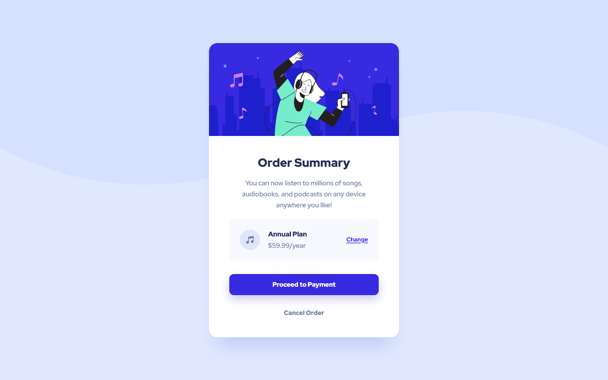

# Frontend Mentor - Order summary card solution

This is a solution to the [Order summary card challenge on Frontend Mentor](https://www.frontendmentor.io/challenges/order-summary-component-QlPmajDUj).

### Screenshot

### Built with

- Semantic HTML5 markup
- Flexbox

### My experience

This is my first Frontend Mentor challenge. It looks simple but trying to match the design files could take some time for a beginner like me. I was also trying to come up with a general process and learn how to use git. Overall, this challenge is a good exercise and will test your fundamentals.

## Author

- Frontend Mentor - [@hcxweb](https://www.frontendmentor.io/profile/hcxweb)
